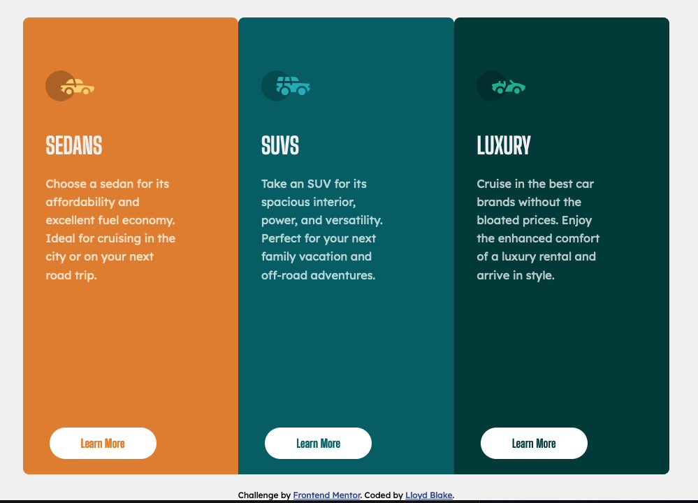
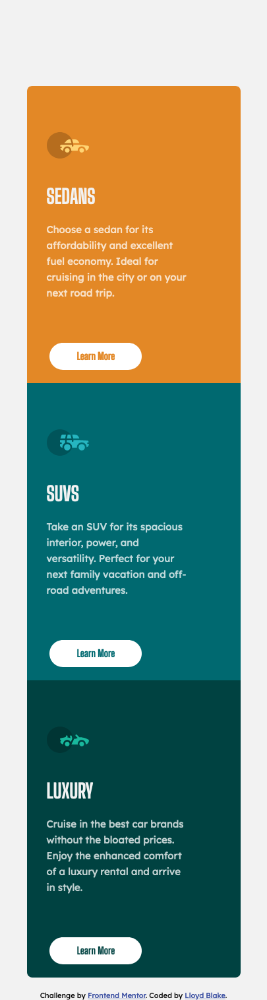

# Frontend Mentor 3-Column-Preview-Card-Component Challenge

This is my solution to the [3-column preview card component challenge on Frontend Mentor](https://www.frontendmentor.io/challenges/3column-preview-card-component-pH92eAR2-). &nbsp;  Frontend Mentor challenges helped me improve my coding skills by building realistic projects. 

## Table of contents

- [Overview](#overview)
  - [The challenge](#the-challenge)
  - [Screenshot](#screenshot)
  - [Links](#links)
  - [Built with](#built-with)
  - [Useful resources](#useful-resources)
- [Author](#author)

## Overview

### The challenge

Users should be able to:

- View the optimal layout depending on their device's screen size
- See hover states for interactive elements

### Screenshot

### Links

- Solution URL: (https://www.frontendmentor.io/solutions/3columnpreviewcomponent-pm8b7BH8Q)
- Live Site URL:(https://frontend-mentor-3-column-preview-component.netlify.app/)

### Built with

- Flexbox
- Semantic HTML5 markup
- CSS custom properties
- Mobile-first workflow

### Useful resources

- (https://css-for-js.dev/) - Josh's course helped me to learn the more in-depth parts of CSS.
- (https://www.kevinpowell.co/courses/) - Kevin's courses are great for learning CSS I used his 'Conquering Responsive Layouts and CSS Demystified' courses to help me with this challenge.  

## Author

- Frontend Mentor - (https://www.frontendmentor.io/profile/lblake)
- Linkedln - (https://www.linkedin.com/in/lloyd-blake-2411383/)

